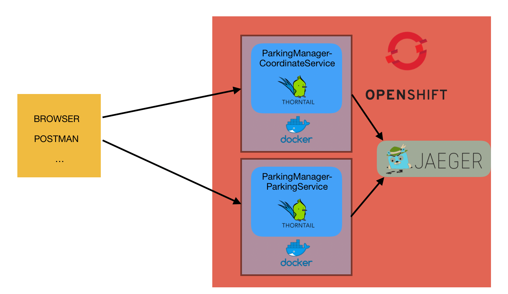
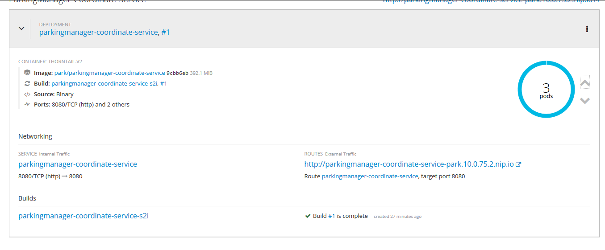
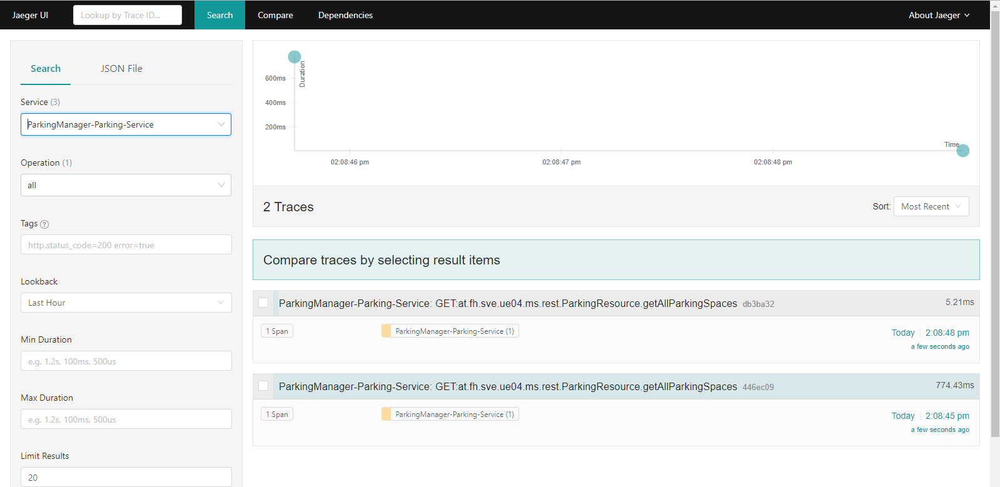

# Dokumentation - SVE - UE05 - Projekt
##### Christoph Ruhsam, Gattringer Marko

### Kurzbeschreibung
Als MUS-Projekt wird eine App zur erleichterten Parkplatzsuche entwickelt. Das Backend zu dieser Anwendung wird mit JavaEE und Thorntail realisiert. Es wird eine Microservice-Architektur gewählt. Weiters werden Swagger (REST-Schnittstellendefinition) und Jaeger (Tracing über Serviceaufrufe) eingebaut. Die Services, sowie SwaggerUI und JaegerUI, laufen in OpenShift und können mittels Fabric8 einfach deployt werden. Die Build-, Test- und Deploymentvorgänge werden mithilfe von Jenkins automatisiert. Arquillian wird als Testframework verwendet.

### Ziel / erwartetes Ergebnis
Microservice-Architektur, welche Lokal (zu Test- und Entwicklungszwecken) als auch in Openshift lauffähig ist.
Es steht eine Infrastruktur zur Verfügung, mit der automatisierte Tests entwickelt werden können (Arquillian).
Es soll einfach möglich sein, einen Serviceaufruf (auch über mehrere Services hinweg) zu tracen (Jaeger).
Die Build-, Test- und Deploymentvorgänge sind mit Jenkins automatisiert.
Ziel ist auch einen stabilen und auf das MUS-Projekt abgestimmten Server, sowie die benötigten REST-Schnittstellen, die vom Python- bzw. Angular-Client benötigt werden, zur Verfügung zu stellen.

### Projektstruktur
* **ParkingManagerCoordinateService:** Microservice zum lesen und bearbeiten von Koordinaten.
* **ParkingManagerParkingService:** Microservice zum lesen und bearbeiten von Parkplatzinformationen.
* **project-stages.yml:** Bei jedem Microservice in src/main/resources zu finden. Hier können für die unterschiedlichen 
Stadien der Entwicklung (zBsp.: Lokal, Openshift, ...) unterschiedliche Konfigurationen hinterlegt werden. So wird in unserem 
Fall zBsp.: der Endpunkt des Jaeger-Agents konfiguriert. Dieser wird lokal als einfacher Dockercontainer gestartet und 
ist unter **localhost:6832** zu erreichen. In Openshift wird dazu ein eigener Pod gestartet und kann dort unter **jaeger-agent:5775** 
erreicht werden.

### Architektur
Folgende Abbildung zeigt die Architektur, wie die Infrastruktur am lokalen Entwicklerrechner aussieht (hier ist Openshift nocht nicht invoviert):

In OpenShift sieht die Architektur wie folgt aus:

##### Verwendete Technologien/Bibliotheken
* **https://microprofile.io/:** Eine Initiative um Java EE für Microsservice-Architekturen zu optimieren.
* **https://www.jaegertracing.io/:** Ein Framework zum Monitoren von Microservices.
* **https://www.openshift.com/:** Ist eine Container-Plattform von Redhat, welche auf Docker und Kubernetes aufbaut.
* **http://arquillian.org/:** Ist eine Testframework, welches beim Testen von Java-Enterprise-Anwendungen unterstützt. 
* **http://fabric8.io/:** Hier wird das Maven-Plugin verwendet. Fabric8 vereinfacht und automatisiert das Deployment in OpenShift.
* **https://jenkins.io/** Automation Server für automatisierte Build-, Test- und Deploymentvorgänge.
* **https://microprofile.io/** Unterschiedliche Metriken, wie Health, Count, Timed, ... 

### Setup
1) Gewünschte Release von https://github.com/openshift/origin/releases/ herunterladen 
   (ACHTUNG: bei 3.10 u. 3.11 gibt es aktuell Probleme beim erstellen von Volumes, mit 3.7 sollte es ohne Probleme funktionieren)

2) In gewünschtes Verzeichnis entpacken und PATH Variable um dieses Verzeichnis erweitern
3) Docker starten (muss laufen damit Openshift Cluster gestartet werden kann, basiert auf Docker-Images)
4) <code>oc cluster up</code>: startet einen neuen Cluster
5) <code>oc login</code>: am lokalen Cluster anmelden (fabric8 deployed in den Cluster an dem man aktuell eingeloggt ist) -> USER/PASSWORT kann beliebig gewählt werden , 
6) <code>oc new-project [PROJEKTNAME]</code>: Legt ein neues Projekt an
7) <code>oc process -f https://raw.githubusercontent.com/jaegertracing/jaeger-openshift/master/all-in-one/jaeger-all-in-one-template.yml | oc create -f -</code>: Deployt ein vorgefertigtes Jaeger Template
8) <code>oc process -f https://raw.githubusercontent.com/sabre1041/openshift-api-swagger/master/openshift-api-swagger-template.yml | oc apply -f-</code>: Deployt ein vorgefertigtes SwaggerUI Template
9) <code>mvn fabric8:deploy -Pfabric8</code>: Muss in dem Root-Verzeichnis des jeweiligen Services ausgeführt werden. Deployt das Service in OpenShift.

### OpenShift - beide
OpenShift ist eine OpenSource Container Application Platform und setzt auf Kubernetes auf.
Nach dem Befehl <code>oc cluster up</code> kann unter **localhost:8443** die grafische Oberfläche aufgerufen werden.
Sind bereits Services in OpenShift deployt, sieht dies in OpenShift wie folgt aus:
  

Ein Service kann auf hinauf-/heruntergescaled werden. Dadurch können mehrere Pods gestartet werden. Das Load-Balancing wird von OpenShift übernommen.

### OpenTracing mit Jaeger - Christoph
Jaeger ist ein Tracing System, das OpenSource zur Verfügung steht. Es wird für Monitoring und Troubleshooting bei Microservice-Architekturen verwendet.
Um Jaeger mit Thorntail und JavaEE verwenden zu können, werden folgende Teile benötigt:
- **io.thorntail.jaeger** und **io.thorntail.microprofile-opentracing** Dependencies
- Annotation **@Traced** bei der REST-Resource
    - @Traced kann über der Klasse angegeben werden -- alle Methoden der Klasse werden getraced
    - @Traced kann aber auch nur über einzelnen Methoden angegeben werden. Es werden lediglich diese Methoden getraced.
- Im *project-stages.yml* folgende Konfigurationsparameter:
    - service-name: Service Name der mit den Spans assoziiert wird
    - agent-host: Host unter dem der jaeger-agent erreichbar ist
        - Dieser ist für die lokale Entwicklung localhost
        - Und in OpenShift **NICHT** die Route von Jaeger, sondern der Container Name von Jaeger. In unserem Fall "jaeger-agent".
    - agent-port: Port unter dem der jaeger-agent erreichbar ist.
    - reporter-flush-interval: Definiert, wie oft Jaeger die Spans flusht
    - sampler-type: Definiert den Typ des Samplers, z.B.: probabilistic oder const
    - sampler-parameter: Configurations-Wert für den Sampler, z.B.: probabilistic = 0.001
    
Ist Jaeger und ein Service deployed und eine getracte REST-Resource dieses Service wird aufgerufen, wird der Span an Jaeger gesendet. Mittels der JaegerUI, deren URL in OpenShift zu sehen ist, können die Traces angesehen werden.

Im project-stages.yml befinden sich 2 verschiedene Stages. Die Stage *test* zum lokalen Deployment und die Stage *openshift* für das Deployment in OpenShift.
Um eine Stage auszuwählen, muss beim Deployment der Maven-Parameter <code>-Dswarm.project.stage=[stage]</code> mitgegeben werden.
Default ist die Stage *openshift* eingestellt.

### MongoDB - Marko
Da es in dieser Übung nicht das Ziel war, dass auch die MongoDB in OpenShift läuft, wurde für das Service **ParkingManagerCoordinateService** ein Mock-Service implementiert. 
Mittels einer CDI-Alternative, die im beans.xml definiert wird, kann zwischen dem eigentlichen Service und dem Mock-Service geswitcht werden.

### Arquillian - Marko
Arquillian ist ein Framework, welches beim Entwickeln von Unit-Tests für Jave-Enterprise-Anwendungen unterstützt. Arquillian liefert 
einen eigenen Runner mit, welcher mit der Annotation <code>@org.junit.runner.RunWith</code> verwendet wird. Dieser Runner verlangt 
eine Methode innerhalb des Testfalles, welche mit <code>org.jboss.arquillian.container.test.api.Deployment</code> annotiert ist. 
In dieser Methode wird das Deployment für den aktuellen Test zusammengebaut. Das bedeuted, man kann in jedem Testfall festlegen welche 
Komponenten und Klassen deployed und getestet werden. Ein weiterer Vorteil dieser Vorgehensweise ist, dass man in jedem Test ein angepasstes 
beans.xml verwenden kann, in welchem dann zBsp. Alternativen aktiviert werden, welche externe Serviceaufrufe oder DB-Zugriffe mocken.
 
### REST - beide
Die beiden Service *ParkingManagerCoordinateService* und *ParkingManagerParkingService* stellen die REST-Schnittstellen für den Python-Client und den Angular-Client bereit.
Das Service *ParkingManagerCoordinateService* dient zum Lesen der Koordinaten und wird vom Angular-Client verwendet.
Das Service *ParkingManagerParkingService* dient zum Schreiben und Aktualisieren der Label-Daten und wird vom Python-Client verwendet.
Beide Services implementieren einen CorsResponseFilter, damit die Clients keine Probleme mit CORS haben.
Beide Services kommunizieren mit der MongoDB mittels HibernateOGM.
 
### REST-Dokumentation mit Swagger - Christoph
Die REST-Dokumentation wird mittels Swagger-erstellt. Dazu werden die beiden Dependencies
* swagger-annotations 
* swagger-jaxrs 

benötigt. Mittels den Annotationen **@Api** über der Resource-Klasse und **@Api-Operation** über den REST-Methoden, erstellt Swagger ein Swagger.json in dem die REST-Dokumentation enthalten ist.
Im Package **config** befindet sich auch eine SwaggerConfig, mit dem auch eine Version, Author und ein Kontakt gesetzt werden.

Die Swagger-UI läuft in OpenShift. In dieser kann das swagger.json eines Service aufgerufen und somit die REST-Schnittstelle einfach getestet werden.
z.b.: <service-url>/api/swagger.json

### Jenkins - Marko
\\\ TODO @Marko

### Metrics - Christoph
Auch Metriken werden bereitgestellt und können bei jedem Service unter der URL <service>/metrics/application abgefragt werden.
Es werden dabei die Metriken **Count**, **Timed** und **Health** bereitgestellt.
* **Count:** Zählt, wie oft eine Ressource aufgerufen wurde.
* **Timed:** Berechnet den Mittelwert der Dauer von Request bis Response aller Anfragen pro Ressource.
* **Health:** Gibt Auskunft über das Befinden eines Pods.